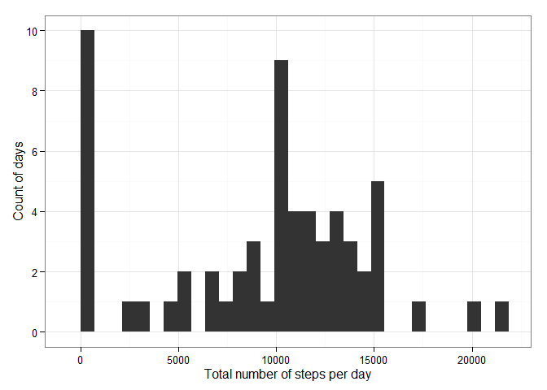

# Reproducible Research: Peer Assessment 1

**Global settings:**

```r
library(knitr)
library(ggplot2)
locale <- Sys.setlocale(category = "LC_ALL", locale = "English")
opts_chunk$set(fig.path = "figure/", message = FALSE)
```

## Loading and preprocessing the data

#### Load the data

Extract the CSV file from the ZIP file:

```r
csv_file <- unzip(zipfile = "activity.zip")
```

Create a dataframe from the CSV file:

```r
data <- read.csv(file = csv_file)
head(data)
```

```
##   steps       date interval
## 1    NA 2012-10-01        0
## 2    NA 2012-10-01        5
## 3    NA 2012-10-01       10
## 4    NA 2012-10-01       15
## 5    NA 2012-10-01       20
## 6    NA 2012-10-01       25
```

#### Process/transform the data into a format suitable for the analysis

Convert interval values in minutes:

```r
chars <- sprintf("%04d", data$interval)
hours <- as.numeric(substr(x = chars, start = 1, stop = 2))
minutes <- as.numeric(substr(x = chars, start = 3, stop = 4))
data$interval <- hours * 60 + minutes
```

Encode interval as factor:

```r
data$interval <- factor(x = data$interval)
```

## What is mean total number of steps taken per day?

#### Calculate the total number of steps taken per day


```r
v_date <- levels(x = data$date)
v_steps <- c(tapply(X = data$steps, INDEX = data$date, FUN = sum, na.rm = TRUE))
total_steps_per_day <- data.frame(date = v_date, steps = v_steps)
row.names(x = total_steps_per_day) <- seq_len(nrow(x = total_steps_per_day))
head(total_steps_per_day)
```

```
##         date steps
## 1 2012-10-01     0
## 2 2012-10-02   126
## 3 2012-10-03 11352
## 4 2012-10-04 12116
## 5 2012-10-05 13294
## 6 2012-10-06 15420
```

#### Make a histogram of the total number of steps taken each day


```r
p <- qplot(x = total_steps_per_day$steps, data = total_steps_per_day,
           xlab = "Total number of steps per day", ylab = "Count of days")
p <- p + scale_y_continuous(breaks = seq(from = 0, to = 10, by = 2))
p <- p + theme_bw()
p
```

 

#### Calculate and report the mean and median of the total number of steps taken
#### per day


```r
mean_steps_per_day <- mean(x = total_steps_per_day$steps)
mean_steps_per_day
```

```
## [1] 9354.23
```

```r
median_steps_per_day <- median(x = total_steps_per_day$steps)
median_steps_per_day
```

```
## [1] 10395
```

```r
p <- p + geom_vline(xintercept = mean_steps_per_day, color = "mediumvioletred")
p <- p + geom_text(label = "Mean", x = mean_steps_per_day, y = 9.75,
                   angle = 90, vjust = -0.5,
                   size = 3, color = "mediumvioletred")
p <- p + geom_vline(xintercept = median_steps_per_day, color = "darkturquoise")
p <- p + geom_text(label = "Median", x = median_steps_per_day, y = 9.75,
                   angle = 90, vjust = -0.5,
                   size = 3, color = "darkturquoise")
p
```

 

## What is the average daily activity pattern?

#### Make a time series plot of the 5-minute interval and the average number of
#### steps taken, averaged across all days


```r
v_interval <- as.numeric(levels(x = data$interval))
v_steps <- c(tapply(X = data$steps, INDEX = data$interval, FUN = mean,
                    na.rm = TRUE))
average_steps_across_days <- data.frame(interval = v_interval, steps = v_steps)
row.names(x = average_steps_across_days) <-
    seq_len(nrow(x = average_steps_across_days))
head(average_steps_across_days)
```

```
##   interval     steps
## 1        0 1.7169811
## 2        5 0.3396226
## 3       10 0.1320755
## 4       15 0.1509434
## 5       20 0.0754717
## 6       25 2.0943396
```

```r
summary(average_steps_across_days$steps)
```

```
##    Min. 1st Qu.  Median    Mean 3rd Qu.    Max. 
##   0.000   2.486  34.110  37.380  52.830 206.200
```

```r
p <- qplot(x = average_steps_across_days$interval / 60,
           y = average_steps_across_days$steps,
           data = average_steps_across_days,
           geom = "line",
           xlab = "Hours of the day",
           ylab = "Average number of steps across days")
p <- p + scale_x_continuous(breaks = seq(from = 0, to = 24, by = 4))
p <- p + theme_bw()
p
```

 

#### Which 5-minute interval, on average across all the days in the dataset,
#### contains the maximum number of steps?


```r
max_average_steps <- max(average_steps_across_days$steps)
max_average_steps_interval <- subset(average_steps_across_days,
                                     steps == max_average_steps)$interval
max_average_steps_interval
```

```
## [1] 515
```

```r
p <- p + geom_vline(xintercept = max_average_steps_interval / 60,
                    color = "mediumvioletred")
p <- p + geom_text(label = "Max", x = max_average_steps_interval / 60, y = 205,
                   angle = 90, vjust = -0.5,
                   size = 3, color = "mediumvioletred")
p
```

 

## Imputing missing values

#### Calculate and report the total number of missing values in the dataset


```r
incomplete_rows <- subset(data, is.na(steps))
number_incomplete_rows <- nrow(incomplete_rows)
number_incomplete_rows
```

```
## [1] 2304
```

#### Devise a strategy for filling in all of the missing values in the dataset

*We will fill the missing values with the rounded mean of the number of steps
taken per interval:*

```r
mean_steps_per_interval <- round(mean_steps_per_day / (60 * 24 / 5))
mean_steps_per_interval
```

```
## [1] 32
```

#### Create a new dataset that is equal to the original dataset but with the
#### missing data filled in


```r
data2 <- data
data2$steps[is.na(data2$steps)] <- mean_steps_per_interval
head(data2)
```

```
##   steps       date interval
## 1    32 2012-10-01        0
## 2    32 2012-10-01        5
## 3    32 2012-10-01       10
## 4    32 2012-10-01       15
## 5    32 2012-10-01       20
## 6    32 2012-10-01       25
```

#### Make a histogram of the total number of steps taken each day


```r
v_date <- levels(x = data2$date)
v_steps <- c(tapply(X = data2$steps, INDEX = data2$date, FUN = sum,
                    na.rm = TRUE))
total_steps_per_day <- data.frame(date = v_date, steps = v_steps)
row.names(x = total_steps_per_day) <- seq_len(nrow(x = total_steps_per_day))
head(total_steps_per_day)
```

```
##         date steps
## 1 2012-10-01  9216
## 2 2012-10-02   126
## 3 2012-10-03 11352
## 4 2012-10-04 12116
## 5 2012-10-05 13294
## 6 2012-10-06 15420
```

```r
p <- qplot(x = total_steps_per_day$steps, data = total_steps_per_day,
           xlab = "Total number of steps per day", ylab = "Count of days")
p <- p + scale_y_continuous(breaks = seq(from = 0, to = 10, by = 2))
p <- p + theme_bw()
p
```

 

#### Calculate and report the mean and median total number of steps taken per
#### day


```r
mean_steps_per_day <- mean(x = total_steps_per_day$steps)
mean_steps_per_day
```

```
## [1] 10562.89
```

```r
median_steps_per_day <- median(x = total_steps_per_day$steps)
median_steps_per_day
```

```
## [1] 10395
```

```r
p <- p + geom_vline(xintercept = mean_steps_per_day, color = "mediumvioletred")
p <- p + geom_text(label = "Mean", x = mean_steps_per_day, y = 8.75,
                   angle = 90, vjust = 1.25,
                   size = 3, color = "mediumvioletred")
p <- p + geom_vline(xintercept = median_steps_per_day, color = "darkturquoise")
p <- p + geom_text(label = "Median", x = median_steps_per_day, y = 8.75,
                   angle = 90, vjust = -0.5,
                   size = 3, color = "darkturquoise")
p
```

 

#### What is the impact of imputing missing data on the estimates of the total
#### daily number of steps?

*We can observe that the mean value is now much closer to the median value,
which has not changed.*

## Are there differences in activity patterns between weekdays and weekends?

#### Create a new factor variable in the dataset with two levels - "weekday" and
#### "weekend" indicating whether a given date is a weekday or weekend day


```r
get_day_type <- function(date) {
    day_name = as.character(weekdays(as.POSIXlt(date)))
    if (day_name == "Saturday" || day_name == "Sunday") {
        "weekend"
    } else {
        "weekday"
    }
}
data2$day_type <- sapply(X = data2$date, FUN = get_day_type)
data2$day_type <- factor(x = data2$day_type)
str(data2)
```

```
## 'data.frame':	17568 obs. of  4 variables:
##  $ steps   : num  32 32 32 32 32 32 32 32 32 32 ...
##  $ date    : Factor w/ 61 levels "2012-10-01","2012-10-02",..: 1 1 1 1 1 1 1 1 1 1 ...
##  $ interval: Factor w/ 288 levels "0","5","10","15",..: 1 2 3 4 5 6 7 8 9 10 ...
##  $ day_type: Factor w/ 2 levels "weekday","weekend": 1 1 1 1 1 1 1 1 1 1 ...
```

```r
head(data2)
```

```
##   steps       date interval day_type
## 1    32 2012-10-01        0  weekday
## 2    32 2012-10-01        5  weekday
## 3    32 2012-10-01       10  weekday
## 4    32 2012-10-01       15  weekday
## 5    32 2012-10-01       20  weekday
## 6    32 2012-10-01       25  weekday
```

#### Make a panel plot containing a time series plot of the 5-minute interval
#### and the average number of steps taken, averaged across all weekday days or
#### weekend days


```r
v_interval <- as.numeric(levels(x = data2$interval))
v_steps_weekday <- c(tapply(X = data2$steps[data2$day_type == "weekday"],
                            INDEX = data2$interval[data2$day_type == "weekday"],
                            FUN = mean, na.rm = TRUE))
v_steps_weekend <- c(tapply(X = data2$steps[data2$day_type == "weekend"],
                            INDEX = data2$interval[data2$day_type == "weekend"],
                            FUN = mean, na.rm = TRUE))
average_steps_across_weekday_days <- data.frame(day_type = "weekday",
                                                interval = v_interval,
                                                steps = v_steps_weekday)
average_steps_across_weekend_days <- data.frame(day_type = "weekend",
                                                interval = v_interval,
                                                steps = v_steps_weekend)
average_steps_across_days <- rbind(average_steps_across_weekday_days,
                                   average_steps_across_weekend_days)
row.names(x = average_steps_across_days) <-
    seq_len(nrow(x = average_steps_across_days))
head(average_steps_across_days)
```

```
##   day_type interval    steps
## 1  weekday        0 6.288889
## 2  weekday        5 4.666667
## 3  weekday       10 4.422222
## 4  weekday       15 4.444444
## 5  weekday       20 4.355556
## 6  weekday       25 5.577778
```

```r
summary(average_steps_across_days$steps)
```

```
##    Min. 1st Qu.  Median    Mean 3rd Qu.    Max. 
##   4.000   5.682  27.060  38.290  58.530 207.200
```

```r
p <- qplot(x = average_steps_across_days$interval / 60,
           y = average_steps_across_days$steps,
           data = average_steps_across_days, facets = day_type ~ .,
           geom = "line", xlab = "Hours of the day",
           ylab = "Average number of steps across days")
p <- p + scale_x_continuous(breaks = seq(from = 0, to = 24, by = 4))
p <- p + theme_bw()
p
```

 
